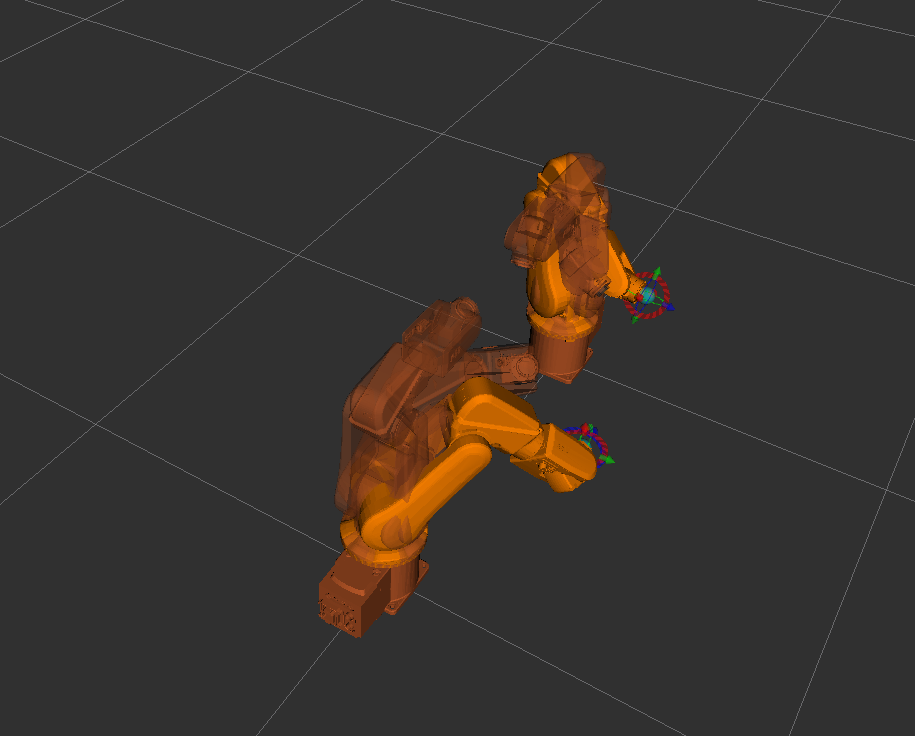

# RMDLO ABB Robot Workspace for Dual-Arm Setup

Building dual-arm robot motion planning framework

Currently using ABB IRB120 industrial robot.

ROS drivers for ABB robots

### For comprehensive guide refer the tutorial.pdf above. The document includes:

- Building a template repo for multi-arm robotics.
- Steps for adding models such as additional arms, sensors and cameras into ROS/MoveIt environment.
- Adding transforms - establishing common links between arms.
- Groups - an easier approach to duplicating existing systems with just a change in namespace.
- Topics - the need for remapping topics while using groups and namespace.

### Current status - 

- Use MoveIt to plan for dual-arm coordinated motion. 
- Collision checking works. 
- Is able to receive and read current joint states of the physical arm (at the moment - one way communication is established). 
- Pending: need to establish two way communication. 

### Coordinated Motion - Dual-Arm Setup

https://user-images.githubusercontent.com/93821405/204172896-e4cfaeb9-4eeb-4013-9db9-88399d4c3a16.mp4

## Installation of ABB Workspace for the first time
```bash
# First update the local rosdep database.
$ rosdep update
# Clone the ABB robot catkin workspace.
$ git clone git@github.com:RMDLO/abb_dual_arm.git --recurse-submodules
# Change to the root of the ABB catkin workspace.
$ cd abb_ws
# Use rosdep to install any missing dependencies.
~abb_ws$ sudo rosdep install --from-paths src --ignore-packages-from-source --rosdistro melodic
# Build the workspace (using catkin_tools).
~abb_ws$ catkin build
```

## To move a robot

1. Turn on the robot IRC5 controller by turning the top left power switch to on. Wait until the teach pendant is on, and then switch the IRC5 controller to [automatic mode from manual mode](!http://wiki.ros.org/abb_driver/Tutorials/RunServer) by turning the key on the cabinet counterclockwise until the white status light turns off. On the robot teach pendant, verify it is okay to switch to automatic mode when prompted. Press the status light on the IRC5 control cabinet again until it turns on.
2.  On the teach pendant, select settings and verify the mode is continuous. Then select PP to Main. Then click the play button on the teach pendant. The play button signals the teach pendant to run the loaded RAPID module.
3. On the desktop computer, in Wired Settings, ensure the ethernet connection to the IRC5 controller is set to "Automatic (DHCP)" in the IPv4 setting. 
4. Open a new terminal, and perform:

```bash
# First activate the workspace to gain access to the built packages.
$ cd abb_ws && source devel/setup.bash
# Launch MoveIt! planning and execution using the robot's IP address.
~abb_ws$ roslaunch abb_irb120_moveit_config moveit_planning_execution.launch sim:=false robot_ip:=192.168.125.1
```


## License

This software is released under the MIT License, see [LICENSE](./LICENSE).