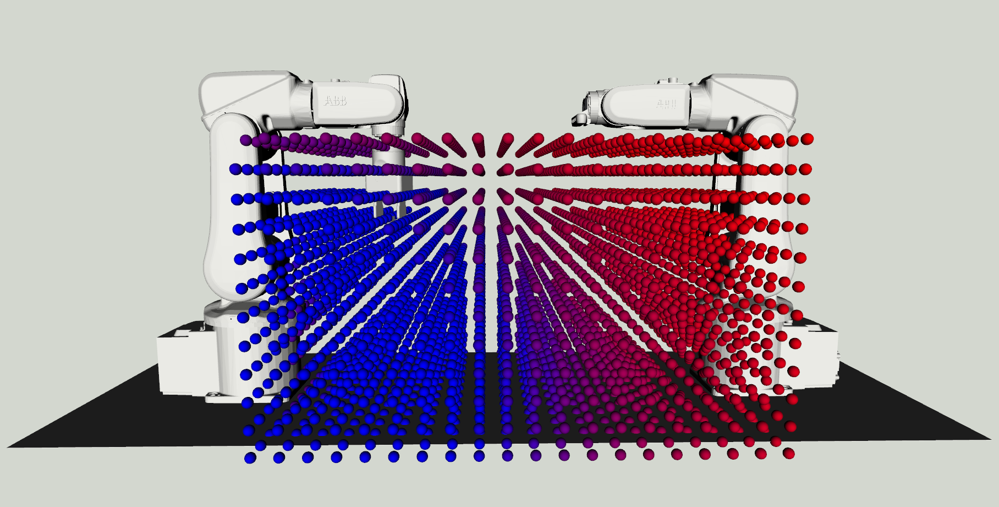

## Analyze Workspace Reachability

This document provides a tutorial for computing and visualizing the workspace reachability, which is helpful when determining if it is possible to execute motion plans within the scene. These steps assume the `abb_dual_arm` workspace is already built and sourced inside a ROS workspace.

First, launch the simulated dual-arm setup in a new terminal with

```bash
roslaunch abb_control abb_control.launch sim:=true
```

Next, run the node which computes reachability in a second new terminal. To visualize an existing reachability `config.json` file, run

Terminal 2:

```bash
rosparam set /reachability/load_reachability_config true
rosparam set /reachability/abb_dual_arm_control_path /path/to/abb_control_pkg
rosrun abb_control abb_compute_reachability.py $ABB true
```

To compute a new workspace reachability `config.json` file, run

```bash
rosparam set /reachability/load_reachability_config false
rosrun abb_control abb_compute_reachability.py
```

This is the visualized dual-arm setup from the repository [`config.json`](https://github.com/RMDLO/abb_dual_arm/blob/master/config/config.json):

<p align="center">
  
</p>